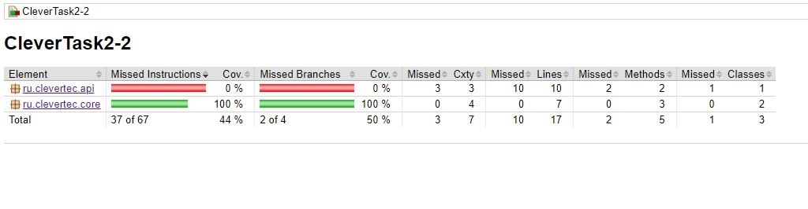

Проект состоит из 2 модулей:
- api - зависит от core;
- core - зависит от  библиотеки utils-1.3.5.jar.

Для агрегации jacoco отчетов используется CustomPlugin-1.0.jar.

utils-1.3.5.jar и  CustomPlugin-1.0.jar загружаются из локального артифактори расположенного в папке libs в корне проекта.
Общие настройки сборки модулей вынесены в script plugin, который расположен в buildSrc.

- source utils.jar - https://github.com/ykuzma/cleverTask2-1.git
- source CustomPlugin.jar - https://github.com/ykuzma/cleverTask2-plugin.git

